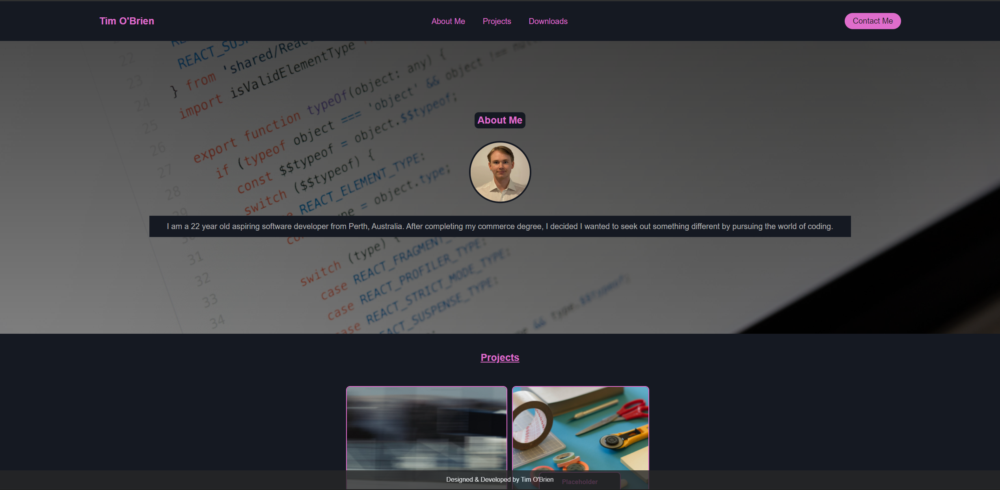

# Challenge 2: Building Portfolio Website

## Task

The task is to produce a personal portfolio page to be hosted on GitHub pages. The portfolio must include an about section, past projects & a contact form.

## Portfolio Overview

The website begins with a flex-box header sitting above the hero image. Inside the hero image is the about me section, and then the projects finally followed by a box of useful resources. Users are able to click the functional contact me button, causing a pop-up form to open.

The primary issue I faced was with the formatting in smaller viewports. I will have to resubmit this assignment at a future date when I get some help with that side of things.

## Link

https://timmobrien.github.io/Advanced-CSS-Portfolio-Challenge